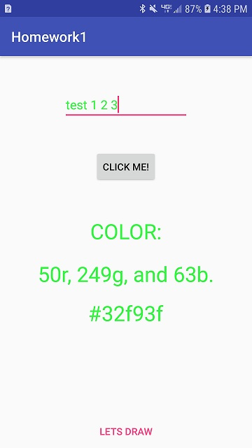
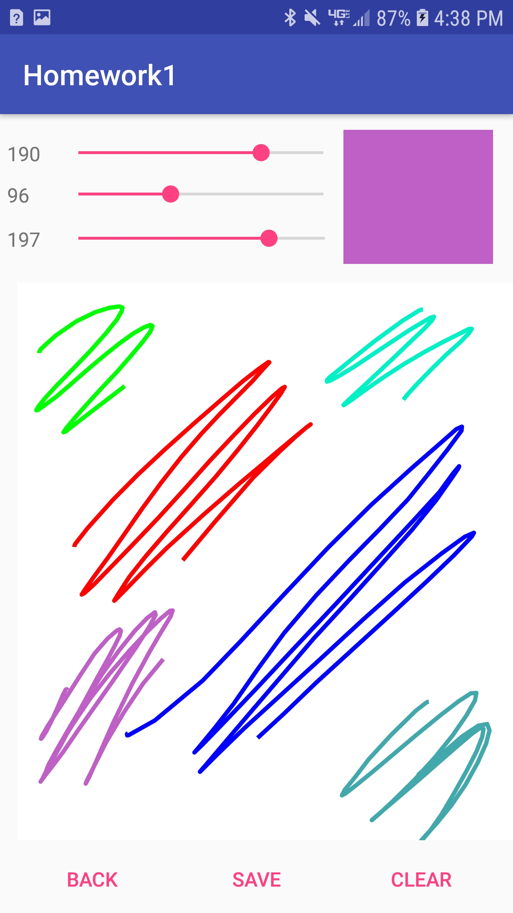

# CEG-4110-01-Homework1

Android Paint Application
---
This Application allows a user to type and generate a random color for a user input text field.  It also 
allows a user to switch to a paint view activity where a user can select a color from a slider formatted
color picker and begin drawing their own art piece.  Once finished this application allows the user to
save his or her art piece directly to their android phone's photo gallery.

Deployment Instructions
---
In the homework1 folder you will navigate to the following directory and find the executable apk
Homework1\app\build\outputs\apk\debug\app-debug-apk

Instructions
---
Below are example images of what the two screens the application has looks like.  On the first page the
user may enter any text into the text field and click the button to generate a random color for the text.
The "LETS DRAW" button triggers the draw activity seen on the second page. Here the user may select any
rgb colro with the color sliders found at the top of the page.  The current selected color is displayed
to the right of the sliders and the user may begin drawing below on the canvas.  Once drawing there the
user has an options to either clear the canvas and start over or save their art piece to their android
phones gallery.

Design
---
This project consists of three classes: MainActivity, Main2Activity, and PaintView.  

MainActivity represents the first activity the users sees and only contains onClick listeners for the 
random color generator and drwawing activity. 

Main2Activity contains holds the rgb seek bars, the sample color view, and the three action buttons 
found at the bottom of the view. The entire center of Main2Activity is made of a single PaintView
Object for the user to draw on.

PaintView contains the canvas that the user can draw on. This class has path and brush objects that are
designed to mirror the users strokes as they draw on the screen.  It also contains functionality to
clear the users drawing and change the brush color.
